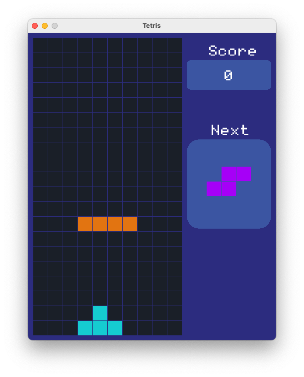
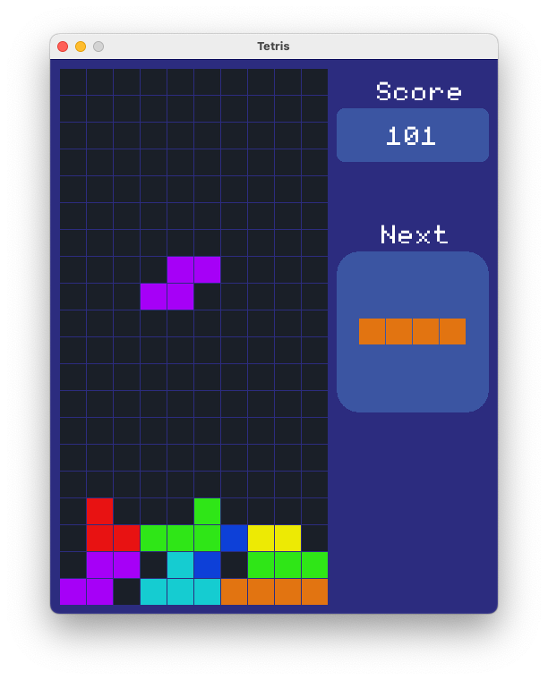

# Tetris Game

Classic Tetris implemented in C++ using the Raylib library.

1. Clone the repository to your local machine using the following command:

```bash
git clone https://github.com/AdmiralStone/Tetris
```

2. Make sure you have a C++ compiler installed on your system.

3. Install the Raylib library by following the instructions provided on their official GitHub repository: [https://github.com/raysan5/raylib](https://github.com/raysan5/raylib)

4. Once you have Raylib installed, navigate to the cloned repository's directory.

5. Compile the source code using the provided Makefile. Run the following command:

```bash
make
```

6. Run the game with the following command:

```bash
bin/./main
```

## How to Play

The objective of the game is to score as many points as possible by clearing lines. Shapes called tetrominoes fall from the top of the screen, and you must rotate and move them to create complete lines. When a line is complete, it disappears, and you earn points. The game ends when the tetrominoes stack up and reach the top of the screen.

Use the following keys to control the game:

- **Left Arrow**: Move the tetromino left.
- **Right Arrow**: Move the tetromino right.
- **Down Arrow**: Move the tetromino down faster.
- **Up Arrow**: Rotate the tetromino.

## Features

- Classic Tetris gameplay with intuitive controls.
- Score tracking and high score display.
- Sound effects and background music.

## Screenshots
<div style="display:flex">
  
  
</div>

## Acknowledgments

- Thanks to the Raylib community for providing a fantastic library for game development.


